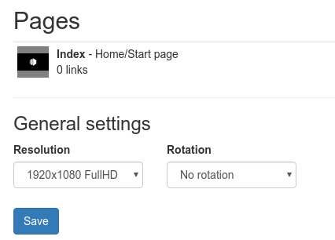
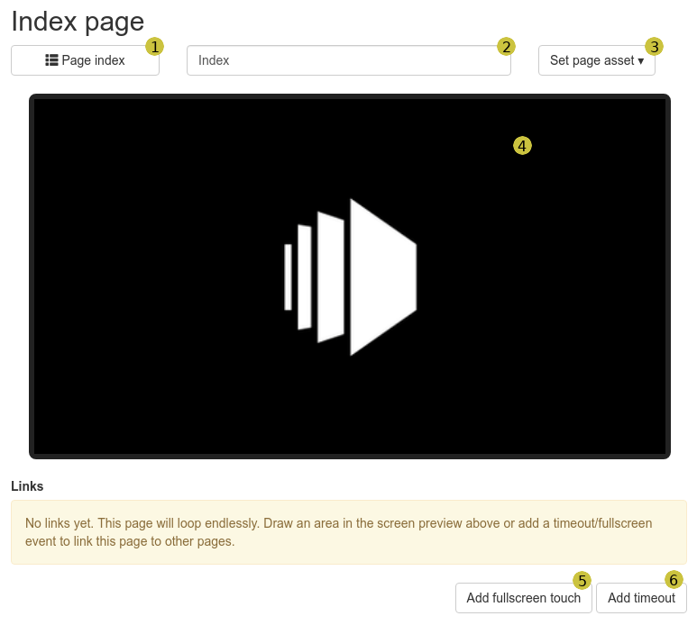
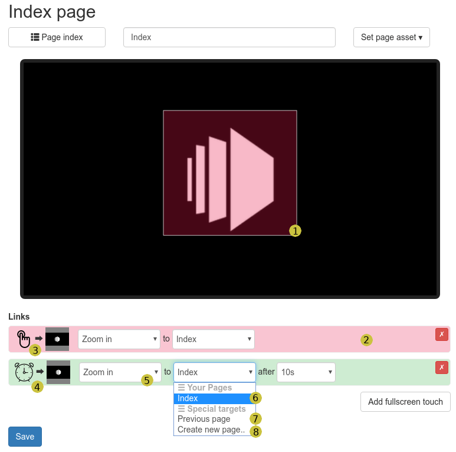

# A interactive touch based content player

This package allows you to created interactive video/image displays. Users can navigate content by touch. Each page consists
of a single piece of content shown on the screen. You can create touchable links to navigate to other pages.
Additionally you can specify timeouts so content can automatically transition between pages without user interaction.

## Configuration

Create a new setup. You will be greeted by the default configuration:

In the _General settings_ section you should set the target resolution of your content as well as the rotation of your
screens. The resolution doesn't necessarily have to match the resolution on your screens. It's mostly used to figure
out the aspect ratio and how content placement works.

Click on the small content icon left to the _Index_ line. You'll see the page editor:

This page allows you to edit the selected page and create or link other pages. Here is what you can do:

1. The top left button allows you to navigate back to the page index.
1. This text field allows you to name the current page. This makes it easier to work with your content.
1. Allows you to select the video or image shown on this page.
1. Previews the current page. The size and aspect ratio is determined by the resolution and rotation settings on the index
   page. You can click and drag an area on the screen preview to create a new touchable link. See below.
1. This button allows you to create a new touch link to another page. This will cover the complete screen. If you want to
   create a smaller touch area, drag/drop on the preview screen (4.) instead.
1. This creates a new timeout navigation.

A page on it's own is pretty boring and will endlessly loop its configured content (changable by clicking on 3.). Pages
get interesting if you link them to other pages. There are multiple ways to create new links: Click on 5. or 6. to create
a fullscreen touch area or timeout link. If you want to have multiple touch areas resulting in different target pages,
click and drag on the preview area (4.) instead.

Here's a page with two links added already:

This page has a single touch link and a timeout link configured. Let's go through the interface:

1. This is a configured touch area. When the user touches the area, the configuration in 2. decides what happens.
1. This is the corresponding configuration for the above touch area. It's also color coded, so this configuration
   is for the red area in the preview screen. 
1. There are two types of links. This is a touch link. A user has to activate it by touching the screen.
1. This is a timeout link. After a configured time (10 seconds in the example), the screen navigates to the
   configured target page.
1. Every link triggers an animation when transitioning to the target page. You can chose from the available
   effects here.
1. Chose the target page from your existing pages.
1. Select _Previous page_ if you want to navigate to the previous page. If you think about a browser, this
   is essentially a "back button".
1. If you want to create a new page, click _Create new page_

You can simulate some of the content navigation by clicking on the touch areas (1. in the above screenshot)
or by clicking on the small preview next to 3./4.

If you need help with this package, you can post to this thread on the
[info-beamer community forum](https://community.infobeamer.com/t/404).

# Changelog

## Version 2023-03-07

* Added support for propagating input events to devices running the same touch player setup within the local network.  Requires P2P enabled devices.
* Added support for sending UDP messages for page enter/exit and link activation. This can be used to switch content on other devices.
* Both features are not exposed through the default UI. Instead, Shift-click on the "Content Configuration" box on the left side in the setup's configuration page.
* Added resizing and deleting touch areas within the graphical view

## Version 2022-08-18

* Unify node events to work similar to the scheduled player

## Version 2021-09-15

* Update support for preserving content aspect ratio

## Version 2021-09-13

* Added GPIO and keyboard support

## Version 2019-12-04

* Support new asset chooser

## Version 2019-08-23

* Now marked as compatible with the Pi4
